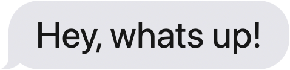

# imessageChatBubblesLib 💬
Простая БЭМ библиотека для создания адаптивного эффекта сообщений как в imassage на твоем сайте! 👏 <br>
A simple BEM library to create an adaptive message effect like in imassage on your site! 👏


## Установка/Installation ⬇️
1. Поместите папку imessageChatBubblesLib в свой проект / Insert folder imessageChatBubblesLib in your project.
2. Подключите CSS / Сonnection CSS:

```html
<link rel="stylesheet" href="imassageChatBubblesLib/imassageChatBubblesLib.css">
```

3. Подключите JS / Connection JS:

```html
<script src="imassageChatBubblesLib/imassageChatBubblesLib.js"></script>
```

## Начало использования / Getting started 🏃🏻‍♂️

1. Элементы чата должны быть помещенны в flex контейнер со следующими параметрами (имя контейнера не важно): <br>
   Chat elements must be placed in a flex container with the following parameters (the name of the container is not important):

```css
.container{ 
  display: flex;
  flex-direction: column;
}
```
2. Для создания отправленного сообщения присвойте класс `.i-send` <br>
	 To create a sent message, assign the class `.i-send`


3. Для создания полученного сообщения присвойте класс `.i-receive` <br>
	 To create a received message, assign the class `.i-receive`


> Элементы адаптивны относительно размера текста и выглядят хорошо в диапазоне FontSize: 12px - 50px. <br>
> The elements are responsive with respect to text size and look good in the FontSize range: 12px - 50px.

4. Указать цвет фона страниц:
	 Specify page background color:

```css
:root{
    --page-bg-color: white;
}
```

>Это важно для корректоного отображения эффектов библиотеки. <br>
>Page color, it is very important to specify the exact color. The correct display of effects depends on this.

5. Переменные библиотеки <br>
	 Library Variables
	 
```css
:root{
    --margin-bottom-massage: .75em; /* margin bottom every message / Нижний отступ каждого сообщения */
    --send-bg-color: #0B93F6; /* Sent message background color / Цвет фона отправленного сообщения */
    --send-text-color: white; /* Sent message text color / Цвет текста отправленного сообщения */
    --receive-bg: #E5E5EA; /* Recived message background color / Цвет фона полученного сообщения */
    --receive-text-color: #171717; /* Recived message text color / Цвет текста полученного сообщения */
    --message-max-width: 75%; /* Max message width / Максимальная ширина сообщения */
    --page-bg-color: white; ❗️❗️ /* Page color, it is very important to specify the exact color. The correct display of effects depends on this. / Цвет страницы, очень важно указать точный цвет. От этого зависит правильное отображение эффектов. */ ❗️❗️
}
```

## In future updates:
- Add mask-image support
- Add animation support via react or css animation
